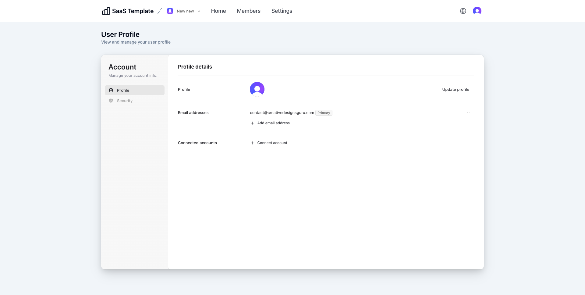
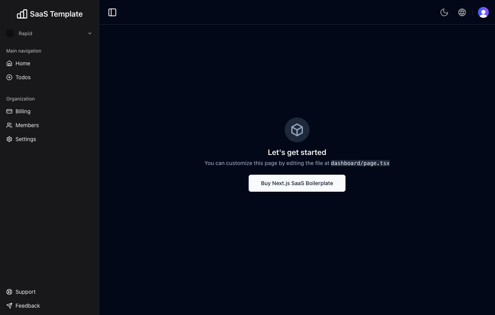

# SaaS Boilerplate with Tailwind CSS and Shadcn UI

<p align="center">
  <a href="https://pro-demo.nextjs-boilerplate.com"></a>
</p>

🚀 **SaaS Boilerplate** is a powerful and fully customizable template to kickstart your SaaS applications. Built with **Next.js** and **Tailwind CSS**, and the modular UI components of **Shadcn UI**. This **Next.js SaaS Template** helps you to quickly build and launch SaaS with minimal effort.

Packed with essential features like built-in **Authentication**, **Multi-Tenancy** with Team support, **Role & Permission**, Database, I18n (internationalization), Landing Page, User Dashboard, Form handling, SEO optimization, Logging, Error reporting with [Sentry](https://sentry.io/for/nextjs/?utm_source=github&utm_medium=paid-community&utm_campaign=general-fy25q1-nextjs&utm_content=github-banner-nextjsboilerplate-logo), Testing, Deployment, Monitoring, and **User Impersonation**, this SaaS template provides everything you need to get started.

Designed with developers in mind, this **Next.js Starter Kit** uses TypeScript for type safety and integrates ESLint to maintain code quality, along with Prettier for consistent code formatting. The testing suite combines Vitest and React Testing Library for robust unit testing, while Playwright handles integration and E2E testing. Continuous integration and deployment are managed via GitHub Actions. For user management, authentication is handled by [Clerk](https://go.clerk.com/zGlzydF). For database operations, it uses Drizzle ORM for type-safe database management across popular databases like PostgreSQL, SQLite, and MySQL.

Whether you're building a new SaaS app or looking for a flexible, **production-ready SaaS template**, this boilerplate has you covered. This free, open-source starter kit has everything you need to accelerate your development and scale your product with ease.

Clone this project and use it to create your own SaaS. You can check the live demo at [SaaS Boilerplate](https://pro-demo.nextjs-boilerplate.com), which is a demo with a working authentication and multi-tenancy system.

## Sponsors

<table width="100%">
  <tr height="187px">
    <td align="center" width="33%">
      <a href="https://go.clerk.com/zGlzydF">
        <picture>
          <source media="(prefers-color-scheme: dark)" srcset="https://github.com/ixartz/SaaS-Boilerplate/assets/1328388/6fb61971-3bf1-4580-98a0-10bd3f1040a2">
          <source media="(prefers-color-scheme: light)" srcset="https://github.com/ixartz/SaaS-Boilerplate/assets/1328388/f80a8bb5-66da-4772-ad36-5fabc5b02c60">
          
        </picture>
      </a>
    </td>
    <td align="center" width="33%">
      <a href="https://l.crowdin.com/next-js">
        <picture>
          <source media="(prefers-color-scheme: dark)" srcset="public/assets/images/crowdin-white.png?raw=true">
          <source media="(prefers-color-scheme: light)" srcset="public/assets/images/crowdin-dark.png?raw=true">
          
        </picture>
      </a>
    </td>
    <td align="center" width="33%">
      <a href="https://sentry.io/for/nextjs/?utm_source=github&utm_medium=paid-community&utm_campaign=general-fy25q1-nextjs&utm_content=github-banner-nextjsboilerplate-logo">
        <picture>
          <source media="(prefers-color-scheme: dark)" srcset="public/assets/images/sentry-white.png?raw=true">
          <source media="(prefers-color-scheme: light)" srcset="public/assets/images/sentry-dark.png?raw=true">
          
        </picture>
      </a>
      <a href="https://about.codecov.io/codecov-free-trial/?utm_source=github&utm_medium=paid-community&utm_campaign=general-fy25q1-nextjs&utm_content=github-banner-nextjsboilerplate-logo">
        <picture>
          <source media="(prefers-color-scheme: dark)" srcset="public/assets/images/codecov-white.svg?raw=true">
          <source media="(prefers-color-scheme: light)" srcset="public/assets/images/codecov-dark.svg?raw=true">
          
        </picture>
      </a>
    </td>
  </tr>
  <tr height="187px">
    <td align="center" style=width="33%">
      <a href="https://nextjs-boilerplate.com/pro-saas-starter-kit">
        
      </a>
    </td>
  </tr>
  <tr height="187px">
    <td align="center" width="33%">
      <a href="mailto:contact@creativedesignsguru.com">
        Add your logo here
      </a>
    </td>
  </tr>
</table>

### Demo

**Live demo: [SaaS Boilerplate](https://pro-demo.nextjs-boilerplate.com)**

| Landing Page | User Dashboard |
| --- | --- |
| [](https://pro-demo.nextjs-boilerplate.com) | [](https://pro-demo.nextjs-boilerplate.com/dashboard) |

| Team Management | User Profile |
| --- | --- |
| [](https://pro-demo.nextjs-boilerplate.com/dashboard/organization-profile/organization-members) | [](https://pro-demo.nextjs-boilerplate.com/dashboard/user-profile) |

| Sign Up | Sign In |
| --- | --- |
| [](https://pro-demo.nextjs-boilerplate.com/sign-up) | [](https://pro-demo.nextjs-boilerplate.com/sign-in) |

| Landing Page with Dark Mode (Pro Version) | User Dashboard with Dark Mode (Pro Version) |
| --- | --- |
| [](https://pro-demo.nextjs-boilerplate.com) | [](https://pro-demo.nextjs-boilerplate.com/dashboard) |

| User Dashboard with Sidebar (Pro Version) |
| --- |
| [](https://pro-demo.nextjs-boilerplate.com) |

### Features

Developer experience first, extremely flexible code structure and only keep what you need:

- ⚡ [Next.js](https://nextjs.org) with App Router support
- 🔥 Type checking [TypeScript](https://www.typescriptlang.org)
- 💎 Integrate with [Tailwind CSS](https://tailwindcss.com) and Shadcn UI
- ✅ Strict Mode for TypeScript and React 19
- 🔒 Authentication with [Clerk](https://go.clerk.com/zGlzydF): Sign up, Sign in, Sign out, Forgot password, Reset password, and more.
- 👤 Passwordless Authentication with Magic Links, Multi-Factor Auth (MFA), Social Auth (Google, Facebook, Twitter, GitHub, Apple, and more), Passwordless login with Passkeys, User Impersonation
- 👥 Multi-tenancy & team support: create, switch, update organization and invite team members
- 📝 Role-based access control and permissions
- 👤 Multi-Factor Auth (MFA), Social Auth (Google, Facebook, Twitter, GitHub, Apple, and more), User Impersonation
- 📦 Type-safe ORM with DrizzleORM, compatible with PostgreSQL, SQLite, and MySQL
- 💽 Offline and local development database with PGlite
- ☁️ Remote and production database with [Prisma Postgres](https://www.prisma.io/?via=nextjs-boilerplate)
- 🌐 Multi-language (i18n) with next-intl and [Crowdin](https://l.crowdin.com/next-js)
- ♻️ Type-safe environment variables with T3 Env
- ⌨️ Form handling with React Hook Form
- 🔴 Validation library with Zod
- 📏 Linter with ESLint (default Next.js, Next.js Core Web Vitals, Tailwind CSS and Antfu configuration)
- 💖 Code Formatter with Prettier
- 🦊 Husky for Git Hooks (replaced by Lefthook)
- 🚫 Lint-staged for running linters on Git staged files
- 🚓 Lint git commit with Commitlint
- 📓 Write standard compliant commit messages with Commitizen
- 🔍 Unused files and dependencies detection with Knip
- 🌍 I18n validation and missing translation detection with i18n-check
- 🦺 Unit Testing with Vitest and Browser mode (replacing React Testing Library)
- 🧪 Integration and E2E Testing with Playwright
- 👷 Run tests on pull request with GitHub Actions
- 🎉 Storybook for UI development
- 🚨 Error Monitoring with [Sentry](https://sentry.io/for/nextjs/?utm_source=github&utm_medium=paid-community&utm_campaign=general-fy25q1-nextjs&utm_content=github-banner-nextjsboilerplate-logo)
- 🔍 Local development error monitoring with Sentry Spotlight
- ☂️ Code coverage with [Codecov](https://about.codecov.io/codecov-free-trial/?utm_source=github&utm_medium=paid-community&utm_campaign=general-fy25q1-nextjs&utm_content=github-banner-nextjsboilerplate-logo)
- 📝 Logging with LogTape and Log Management with [Better Stack](https://betterstack.com/?utm_source=github&utm_medium=sponsorship&utm_campaign=next-js-boilerplate)
- 🖥️ Monitoring as Code with [Checkly](https://www.checklyhq.com/?utm_source=github&utm_medium=sponsorship&utm_campaign=next-js-boilerplate)
- 🔐 Security and bot protection ([Arcjet](https://launch.arcjet.com/Q6eLbRE))
- 🎁 Automatic changelog generation with Semantic Release
- 🔍 Visual regression testing
- 💡 Absolute Imports using `@` prefix
- 🗂 VSCode configuration: Debug, Settings, Tasks and Extensions
- 🤖 SEO metadata, JSON-LD and Open Graph tags
- 🗺️ Sitemap.xml and robots.txt
- 👷 Automatic dependency updates with Dependabot
- ⌘ Database exploration with Drizzle Studio and CLI migration tool with Drizzle Kit
- ⚙️ Bundler Analyzer
- 🌈 Include a FREE minimalist theme
- 💯 Maximize lighthouse score

Built-in features from Next.js:

- ☕ Minify HTML & CSS
- 💨 Live reload
- ✅ Cache busting

### Philosophy

- Nothing is hidden from you, allowing you to make any necessary adjustments to suit your requirements and preferences.
- Dependencies are updated every month
- Start for free without upfront costs
- Easy to customize
- Minimal code
- SEO-friendly
- Everything you need to build a SaaS
- 🚀 Production-ready

### Requirements

- Node.js 22+ and npm

### Getting started

Run the following command on your local environment:

```shell
git clone --depth=1 https://github.com/Nextlessjs/Next-js-Boilerplate-Pro.git my-project-name
cd my-project-name
npm install
```

For your information, all dependencies are updated every month.

Then, you can run the project locally in development mode with live reload by executing:

```shell
npm run dev
```

Open http://localhost:3000 with your favorite browser to see your project. For your information, the project is already pre-configured with a local database using PGlite. No extra setup is required to run the project locally.

### Set up authentication

To get started, create a Clerk account at [Clerk.com](https://go.clerk.com/zGlzydF) and create a new application in the Clerk Dashboard. Then copy the `NEXT_PUBLIC_CLERK_PUBLISHABLE_KEY` and `CLERK_SECRET_KEY` values and add them to your `.env.local` file (not tracked by Git):

```shell
NEXT_PUBLIC_CLERK_PUBLISHABLE_KEY=your_clerk_pub_key
CLERK_SECRET_KEY=your_clerk_secret_key
```

In your Clerk Dashboard, you also need to `Enable Organization` by navigating to `Organization management` > `Settings` > `Enable organization`.

You now have a fully functional authentication system with Next.js, including features such as sign up, sign in, sign out, forgot password, reset password, update profile, update password, update email, delete account, and more.

Optional: To enable multi-session functionality, which allows users to be signed into multiple accounts simultaneously, navigate to `Session management` > `Sessions` > `Multi-session handling` in your Clerk Dashboard and enable this feature.

### Set up remote database

The project uses DrizzleORM, a type-safe ORM that is compatible with PostgreSQL, SQLite, and MySQL databases. By default, the project is set up to work seamlessly with PostgreSQL and you can easily choose any PostgreSQL database provider. Here are some popular options:

- Neon.tech - Tested and works great with the project
- [Prisma PostgreSQL](https://www.prisma.io/?via=nextjs-boilerplate) - Tested and works great with the project
- AWS
- Xata
- Tembo.io
- Digital Ocean
- Google Cloud
- Microsoft Azure
- Render

#### Create a fresh and empty database

If you want to create a fresh and empty database, you just need to remove the folder `local.db` from the root of the project. The next time you run the project, a new database will be created automatically.

### Translation (i18n) setup

For translation, the project uses `next-intl` combined with [Crowdin](https://l.crowdin.com/next-js). As a developer, you only need to take care of the English (or another default language) version. Translations for other languages are automatically generated and handled by Crowdin. You can use Crowdin to collaborate with your translation team or translate the messages yourself with the help of machine translation.

To set up translation (i18n), create an account at [Crowdin.com](https://l.crowdin.com/next-js) and create a new project. In the newly created project, you will be able to find the project ID. You will also need to create a new Personal Access Token by going to Account Settings > API. Then, in your GitHub Actions, you need to define the following environment variables: `CROWDIN_PROJECT_ID` and `CROWDIN_PERSONAL_TOKEN`.

After defining the environment variables in your GitHub Actions, your localization files will be synchronized with Crowdin every time you push a new commit to the `main` branch.

### Project structure

```shell
.
├── README.md                       # README file
├── .github                         # GitHub folder
│   ├── actions                     # Reusable actions
│   └── workflows                   # GitHub Actions workflows
├── .storybook                      # Storybook folder
├── .vscode                         # VSCode configuration
├── migrations                      # Database migrations
├── public                          # Public assets folder
├── scripts                         # Scripts folder
├── src
│   ├── app                         # Next JS App (App Router)
│   ├── components                  # React components
│   ├── features                    # Components specific to a feature
│   ├── libs                        # 3rd party libraries configuration
│   ├── locales                     # Locales folder (i18n messages)
│   ├── models                      # Database models
│   ├── styles                      # Styles folder
│   ├── templates                   # Templates folder
│   ├── types                       # Type definitions
│   ├── utils                       # Utilities folder
│   └── validations                 # Validation schemas
├── tests
│   ├── e2e                         # E2E tests, also includes Monitoring as Code
│   └── integration                 # Integration tests
├── next.config.ts                  # Next JS configuration
└── tsconfig.json                   # TypeScript configuration
```

### Customization

You can easily configure SaaS Boilerplate by searching the entire project for `FIXME:` to make quick customization. Here are some of the most important files to customize:

- `public/apple-touch-icon.png`, `public/favicon.ico`, `public/favicon-16x16.png` and `public/favicon-32x32.png`: your website favicon
- `src/utils/AppConfig.ts`: configuration file
- `src/templates/BaseTemplate.tsx`: default theme
- `next.config.ts`: Next.js configuration
- `.env`: default environment variables

You have full access to the source code for further customization. The provided code is just an example to help you start your project. The sky's the limit 🚀.

In the source code, you will also find `PRO` comments that indicate the code that is only available in the PRO version.

### Change database schema

To modify the database schema in the project, you can update the schema file located at `./src/models/Schema.ts`. This file defines the structure of your database tables using the Drizzle ORM library.

After making changes to the schema, generate a migration by running the following command:

```shell
npm run db:generate
```

This will create a migration file that reflects your schema changes.

After making sure your database is running, you can apply the generated migration using:

```shell
npm run db:migrate
```

There is no need to restart the Next.js server for the changes to take effect.

### Commit Message Format

The project follows the [Conventional Commits](https://www.conventionalcommits.org/) specification, meaning all commit messages must be formatted accordingly. To help you write commit messages, the project provides an interactive CLI that guides you through the commit process. To use it, run the following command:

```shell
npm run commit
```

One of the benefits of using Conventional Commits is the ability to automatically generate GitHub releases. It also allows us to automatically determine the next version number based on the types of commits that are included in a release.

### Subscription payment with Stripe

The project is integrated with Stripe for subscription payment. First, you need to create a Stripe account.

In your Stripe Dashboard, you are required to configure your customer portal settings at https://dashboard.stripe.com/test/settings/billing/portal. Most importantly, don't forget to save the settings even you don't change anything. This is necessary to ensure that the customer portal works correctly.

#### Stripe setup

You also need to install the Stripe CLI. You can install the Stripe CLI by following the instructions this [documentation](https://docs.stripe.com/stripe-cli).

After installing the Stripe CLI, you need to login using the CLI:

```shell
stripe login
```

Then, you can run the following command to set up your Stripe account and create different prices for your subscription plans:

```shell
npm run stripe:setup-price
```

After running the command, you need to copy the price ID and paste it in `src/utils/AppConfig.ts` by updating the existing price ID with the new ones.

In your `.env` file, you need to update the `NEXT_PUBLIC_STRIPE_PUBLISHABLE_KEY` with your Stripe Publishable key. You can find the key in your Stripe Dashboard. Then, you also need to create a new file named `.env.local` and add the following environment variables in the newly created file:

```shell
STRIPE_SECRET_KEY=your_stripe_secret_key
STRIPE_WEBHOOK_SECRET=your_stripe_webhook_secret
```

You get the `STRIPE_SECRET_KEY` from your Stripe Dashboard. The `STRIPE_WEBHOOK_SECRET` is generated by running the following command:

```shell
npm run stripe:listen
```

You'll find the webhook signing secret in your terminal. You can copy it and paste it in your `.env.local` file.

#### Running Stripe webhooks locally

Now, you are ready to test the Stripe integration in your local environment. In one terminal, you need to run your Next.js application in development mode:

```shell
npm run dev
```

And, in another terminal, you need to run the Stripe webhook listener to forward Stripe events to your local development server:

```shell
npm run stripe:listen
```

This allows you to test subscription events, payment completions, and other Stripe webhooks locally without deploying your application.

### Testing

All unit tests are located alongside the source code in the same directory, making them easier to find. The unit test files follow this format: `*.test.ts` or `*.test.tsx`. The project uses Vitest and React Testing Library for unit testing. You can run the tests with the following command:

```shell
npm run test
```

### Integration & E2E Testing

The project uses Playwright for integration and end-to-end (E2E) testing. Integration test files use the `*.spec.ts` extension, while E2E test files use the `*.e2e.ts` extension. You can run the tests with the following commands:

```shell
npx playwright install # Only for the first time in a new environment
npm run test:e2e
```

### Storybook

Storybook is configured for UI component development and testing. The project uses Storybook with Next.js and Vite integration, including accessibility testing and documentation features.

Stories are located alongside your components in the `src` directory and follow the pattern `*.stories.ts` or `*.stories.tsx`.

You can run Storybook in development mode with:

```shell
npm run storybook
```

This will start Storybook on http://localhost:6006 where you can view and interact with your UI components in isolation.

To run Storybook tests in headless mode, you can use the following command:

```shell
npm run storybook:test
```

### Local Production Build

Generate an optimized production build locally using a temporary in-memory Postgres database:

```shell
npm run build-local
```

This command:

- Starts a temporary in-memory Database server
- Runs database migrations with Drizzle Kit
- Builds the Next.js app for production
- Shuts down the temporary DB when the build finishes

Notes:

- By default, it uses a local database, but you can also use `npm run build` with a remote database.
- This only creates the build, it doesn't start the server. To run the build locally, use `npm run start`.

### Deploy to production

During the build process, database migrations are automatically executed, so there's no need to run them manually. However, you must define `DATABASE_URL` in your environment variables.

Then, you can generate a production build with:

```shell
$ npm run build
```

It generates an optimized production build of the boilerplate. To test the generated build, run:

```shell
$ npm run start
```

You also need to defined the environment variables `CLERK_SECRET_KEY` using your own key.

This command starts a local server using the production build. You can now open http://localhost:3000 in your preferred browser to see the result.

Here are some popular hosting options without Docker for deploying your Next.js application:

- Vercel - Tested and works great with the project
- Netlify
- AWS Amplify

### Error Monitoring

The project uses [Sentry](https://sentry.io/for/nextjs/?utm_source=github&utm_medium=paid-community&utm_campaign=general-fy25q1-nextjs&utm_content=github-banner-nextjsboilerplate-logo) to monitor errors.

#### Local development with Sentry and Spotlight

In the development environment, no additional setup is required: Next.js Boilerplate comes pre-configured with Sentry and Spotlight (Sentry for Development). All errors are automatically captured by your local Spotlight instance, enabling testing without sending data to Sentry Cloud.

You can inspect captured events, view stack traces, and analyze errors in the Spotlight UI at `http://localhost:8969`.

#### Production setup with Sentry

For production environment, you'll need to create a Sentry account and a new project. Then, in `.env.production`, you need to update the following environment variables:

```shell
NEXT_PUBLIC_SENTRY_DSN=
SENTRY_ORGANIZATION=
SENTRY_PROJECT=
```

You also need to create a environment variable `SENTRY_AUTH_TOKEN` in your hosting provider's dashboard.

### Code coverage

SaaS Boilerplate relies on [Codecov](https://about.codecov.io/codecov-free-trial/?utm_source=github&utm_medium=paid-community&utm_campaign=general-fy25q1-nextjs&utm_content=github-banner-nextjsboilerplate-logo) for code coverage reporting solution. To enable Codecov, create a Codecov account and connect it to your GitHub account. Your repositories should appear on your Codecov dashboard. Select the desired repository and copy the token. In GitHub Actions, define the `CODECOV_TOKEN` environment variable and paste the token.

Make sure to create `CODECOV_TOKEN` as a GitHub Actions secret, do not paste it directly into your source code.

### Logging

The project uses LogTape for logging. In the development environment, logs are displayed in the console by default.

For production, the project is already integrated with [Better Stack](https://betterstack.com/?utm_source=github&utm_medium=sponsorship&utm_campaign=next-js-boilerplate) to manage and query your logs using SQL. To use Better Stack, you need to create a [Better Stack](https://betterstack.com/?utm_source=github&utm_medium=sponsorship&utm_campaign=next-js-boilerplate) account and create a new source: go to your Better Stack Logs Dashboard > Sources > Connect source. Then, you need to give a name to your source and select JavaScript as the platform.

After creating the source, you will be able to view and copy your source token. In your environment variables, paste the token into the `NEXT_PUBLIC_BETTER_STACK_SOURCE_TOKEN` variable. You'll also need to define the `NEXT_PUBLIC_BETTER_STACK_INGESTING_HOST` variable, which can be found in the same place as the source token.

Now, all logs will automatically be sent to and ingested by Better Stack.

### Checkly monitoring

The project uses [Checkly](https://www.checklyhq.com/?utm_source=github&utm_medium=sponsorship&utm_campaign=next-js-boilerplate) to ensure that your production environment is always up and running. At regular intervals, Checkly runs the tests ending with `*.check.e2e.ts` extension and notifies you if any of the tests fail. Additionally, you have the flexibility to execute tests from multiple locations to ensure that your application is available worldwide.

To use Checkly, you must first create an account on [their website](https://www.checklyhq.com/?utm_source=github&utm_medium=sponsorship&utm_campaign=next-js-boilerplate). After creating an account, generate a new API key in the Checkly Dashboard and set the `CHECKLY_API_KEY` environment variable in GitHub Actions. Additionally, you will need to define the `CHECKLY_ACCOUNT_ID`, which can also be found in your Checkly Dashboard under User Settings > General.

To complete the setup, update the `checkly.config.ts` file with your own email address and production URL.

### Useful commands

### Code Quality and Validation

The project includes several commands to ensure code quality and consistency. You can run:

- `npm run lint` to check for linting errors
- `npm run lint:fix` to automatically fix fixable issues from the linter
- `npm run check:types` to verify type safety across the entire project
- `npm run check:deps` help identify unused dependencies and files
- `npm run check:i18n` ensures all translations are complete and properly formatted

#### Bundle Analyzer

SaaS Boilerplate includes a built-in bundle analyzer. It can be used to analyze the size of your JavaScript bundles. To begin, run the following command:

```shell
npm run build-stats
```

By running the command, it'll automatically open a new browser window with the results.

#### Database Studio

The project is already configured with Drizzle Studio to explore the database. You can run the following command to open the database studio:

```shell
npm run db:studio
```

Then, you can open https://local.drizzle.studio with your favorite browser to explore your database.

### VSCode information (optional)

If you are VSCode user, you can have a better integration with VSCode by installing the suggested extension in `.vscode/extension.json`. The starter code comes up with Settings for a seamless integration with VSCode. The Debug configuration is also provided for frontend and backend debugging experience.

With the plugins installed in your VSCode, ESLint and Prettier can automatically fix the code and display errors. The same applies to testing: you can install the VSCode Vitest extension to automatically run your tests, and it also shows the code coverage in context.

Pro tips: if you need a project wide-type checking with TypeScript, you can run a build with <kbd>Cmd</kbd> + <kbd>Shift</kbd> + <kbd>B</kbd> on Mac.

### FAQ

#### Why are webhooks not necessary for Clerk?

For most applications, there is no need to sync with Clerk using webhooks. In the Todo app example, the data related to users, organizations, and roles is stored in Clerk. It only uses the ID as the primary key for the database table.

Of course, if your application is more complex, you can synchronize the data with Clerk using webhooks.

To integrate with Stripe, we follow a different approach due to Stripe's rate limiting. Instead of making direct API calls to Stripe each time, we store important Stripe data in our database and synchronize it using webhooks.

### Contributions

Everyone is welcome to contribute to this project. Feel free to open an issue if you have any questions or find a bug. Totally open to suggestions and improvements.

### License

Licensed under the MIT License, Copyright © 2026

See [LICENSE](LICENSE) for more information.

## Sponsors

<table width="100%">
  <tr height="187px">
    <td align="center" width="33%">
      <a href="https://go.clerk.com/zGlzydF">
        <picture>
          <source media="(prefers-color-scheme: dark)" srcset="https://github.com/ixartz/SaaS-Boilerplate/assets/1328388/6fb61971-3bf1-4580-98a0-10bd3f1040a2">
          <source media="(prefers-color-scheme: light)" srcset="https://github.com/ixartz/SaaS-Boilerplate/assets/1328388/f80a8bb5-66da-4772-ad36-5fabc5b02c60">
          
        </picture>
      </a>
    </td>
    <td align="center" width="33%">
      <a href="https://l.crowdin.com/next-js">
        <picture>
          <source media="(prefers-color-scheme: dark)" srcset="public/assets/images/crowdin-white.png?raw=true">
          <source media="(prefers-color-scheme: light)" srcset="public/assets/images/crowdin-dark.png?raw=true">
          
        </picture>
      </a>
    </td>
    <td align="center" width="33%">
      <a href="https://sentry.io/for/nextjs/?utm_source=github&utm_medium=paid-community&utm_campaign=general-fy25q1-nextjs&utm_content=github-banner-nextjsboilerplate-logo">
        <picture>
          <source media="(prefers-color-scheme: dark)" srcset="public/assets/images/sentry-white.png?raw=true">
          <source media="(prefers-color-scheme: light)" srcset="public/assets/images/sentry-dark.png?raw=true">
          
        </picture>
      </a>
      <a href="https://about.codecov.io/codecov-free-trial/?utm_source=github&utm_medium=paid-community&utm_campaign=general-fy25q1-nextjs&utm_content=github-banner-nextjsboilerplate-logo">
        <picture>
          <source media="(prefers-color-scheme: dark)" srcset="public/assets/images/codecov-white.svg?raw=true">
          <source media="(prefers-color-scheme: light)" srcset="public/assets/images/codecov-dark.svg?raw=true">
          
        </picture>
      </a>
    </td>
  </tr>
  <tr height="187px">
    <td align="center" style=width="33%">
      <a href="https://nextjs-boilerplate.com/pro-saas-starter-kit">
        
      </a>
    </td>
  </tr>
  <tr height="187px">
    <td align="center" width="33%">
      <a href="mailto:contact@creativedesignsguru.com">
        Add your logo here
      </a>
    </td>
  </tr>
</table>

---

Made with ♥ by [CreativeDesignsGuru](https://creativedesignsguru.com) [](https://twitter.com/ixartz)

Looking for a custom boilerplate to kick off your project? I'd be glad to discuss how I can help you build one. Feel free to reach out anytime at contact@creativedesignsguru.com!

[](https://github.com/sponsors/ixartz)
