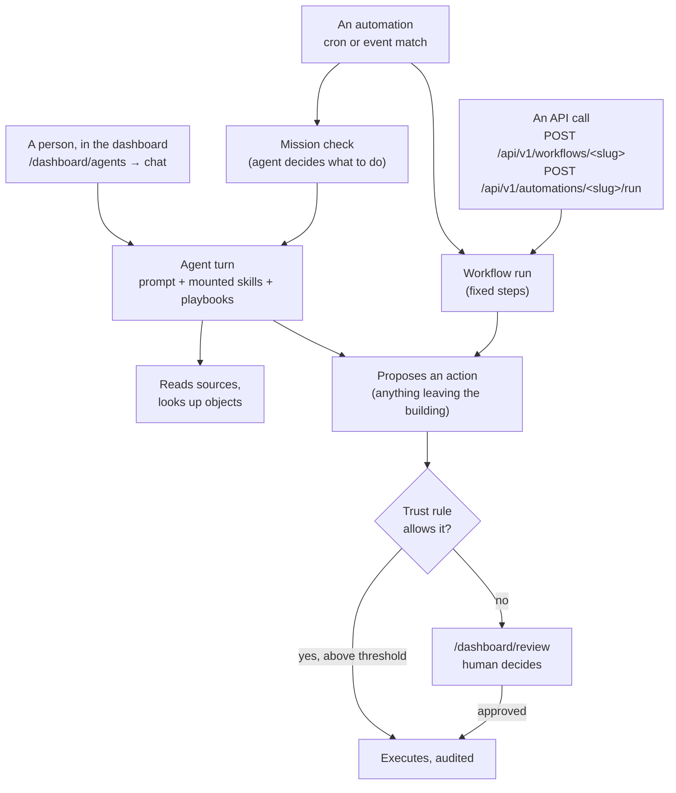

# Getting started — build an agent workforce from zero

This is the front door. Read it top to bottom once and you will know what every
file in a Vocion workspace does, why it exists, and the order to write them in.
No prior Vocion knowledge assumed.

By the end you will have built a small revenue workforce for a fictional
company, Harbor Supply: a lead agent, two specialists under it, a team, a
skill, a playbook, a live data source, a business object type, a standing
mission, a schedule that fires it, a deterministic workflow with a human gate,
an auto-approval rule, a learning bucket, an eval set, and a custom dashboard
page. That is every authored entity type in the framework.

**Contents**

1. [The one idea: configuration, not API calls](#1-the-one-idea-configuration-not-api-calls)
2. [The mental model](#2-the-mental-model)
3. [How a run actually happens](#3-how-a-run-actually-happens)
4. [Setup](#4-setup)
5. [Step 1 — the workspace manifest](#step-1--the-workspace-manifest)
6. [Step 2 — your first agent](#step-2--your-first-agent)
7. [Step 3 — check, apply, talk to it](#step-3--check-apply-talk-to-it)
8. [Step 4 — teams and specialists](#step-4--teams-and-specialists)
9. [Step 5 — a skill](#step-5--a-skill)
10. [Step 6 — a playbook](#step-6--a-playbook)
11. [Step 7 — a source](#step-7--a-source)
12. [Step 8 — an object type](#step-8--an-object-type)
13. [Step 9 — a mission](#step-9--a-mission)
14. [Step 10 — an automation](#step-10--an-automation)
15. [Step 11 — a workflow](#step-11--a-workflow)
16. [Step 12 — trust rules](#step-12--trust-rules)
17. [Step 13 — learnings, evals, and a page](#step-13--learnings-evals-and-a-page)
18. [The finished workspace](#the-finished-workspace)
19. [Which entity do I use?](#which-entity-do-i-use)
20. [Reuse across tenants: base packs](#reuse-across-tenants-base-packs)
21. [Common mistakes](#common-mistakes)
22. [Glossary](#glossary)
23. [Where to go next](#where-to-go-next)

---

## 1. The one idea: configuration, not API calls

Most agent frameworks are libraries. You import them, write Python or
TypeScript, instantiate an agent, register tools with decorators, and your
agent's behavior lives inside your application code. Changing the prompt means
changing code, opening a PR against your app, and deploying.

Vocion inverts that. **The agents are data.** A workspace is a directory of
YAML and Markdown in git; the running platform reads it. You do not write code
to add an agent, a skill, or a schedule — you write a file and apply it.

| | Library-style framework | Vocion |
|---|---|---|
| Add an agent | Write a class, deploy the app | Add `agents/<slug>.yaml`, apply |
| Change a prompt | Edit source, deploy | Edit a Markdown file, apply |
| Add a scheduled run | Wire a cron job in code | Add `automations/<slug>.yaml`, apply |
| Review a change | Read a code diff | Read a YAML/Markdown diff |
| Who can author | Engineers | Anyone who can open a PR |
| Where behavior lives | Your application | A tenant-owned git repo |
| Trace an output | Logs, if you added them | The exact `workspace_sha` that produced it |

What that buys you:

- **Reviewable.** A change to how an agent talks to prospects is a Markdown diff a non-engineer can read and comment on.
- **Reproducible.** Every tool call records the `workspace_sha` it ran under, so "why did it write that?" is answerable six months later with `git show`.
- **Portable.** The workspace is the client's. It lives outside this repo and moves with them.
- **Multi-tenant without forks.** One core, many workspaces. Tenant-specific behavior never lands in core.

There is still an API — HTTP endpoints and an MCP server — but you use it to
*drive* work (start a run, approve an action), not to *define* the workforce.
Defining is always files.

One consequence worth internalizing early: **nothing takes effect until you
apply it.** Editing YAML changes nothing on its own. The loop is always
*edit → check → apply*.

---

## 2. The mental model

A workspace answers eight questions. Each question is one file type.

| Question | Entity | File |
|---|---|---|
| **Who** works here? | [Agent](./entities/agent.md) | `agents/<slug>.yaml` |
| How are they **organized**? | [Team](./entities/team.md) | `teams/<slug>.yaml` |
| **How** do they do a specific job? | [Skill](./entities/skill.md) | `skills/<slug>/SKILL.md` |
| What must they **always know**? | [Playbook](./entities/playbook.md) | `playbooks/<slug>/SKILL.md` |
| **Why** are they here — what standing responsibility? | [Mission](./entities/mission.md) | `missions/<slug>.yaml` |
| What is the **fixed procedure**, step by step? | [Workflow](./entities/workflow.md) | `workflows/<slug>/workflow.yaml` |
| **When** does anything happen? | [Automation](./entities/automation.md) | `automations/<slug>.yaml` |
| **What data** can they see, and what are the **records**? | [Source](./entities/source.md), [Object type](./entities/object-type.md) | `sources/<slug>.yaml`, `objects/<slug>/type.yaml` |

Plus three that shape how much rope the workforce gets and how you improve it:
[trust rules](./entities/trust.md) (what may run without a human),
[learning steps](./entities/learning-step.md) (rules that accumulate from
experience), and [eval datasets](./entities/eval-dataset.md) (test cases that
prove an agent still behaves). And one for what people see:
[workspace pages](./workspace-pages.md).

Two distinctions cause most of the early confusion, so learn them now.

**Mission vs. workflow.** A mission is a *goal* — open-ended, judgement-heavy,
recurring ("no deal goes quiet for more than ten days"). A workflow is a
*procedure* — the same steps every single run ("sync mail, draft the reply,
get it approved, send it"). If you can write the steps down and they never
change, it is a workflow. If the right move depends on what the agent finds,
it is a mission.

**Neither one knows when it runs — almost.** Workflows carry no trigger logic
at all, and a mission carries no procedure. Timing lives in automations, with
one exception: a mission may set its own `schedule`, which makes its owning
agent re-read the charter on that cadence (a *charter check*). So "what runs on
a timer?" is `automations/` plus any mission with a `schedule:`.

**Skill vs. playbook.** A skill is *something you do* and the agent picks it up
when the model judges it relevant. A playbook is *context that is always
there* — house style, etiquette, a pricing policy — attached to a skill or an
agent by name. Both are a folder with a `SKILL.md` inside; the folder they live
in decides which they are.

---

## 3. How a run actually happens

Three things start work, and everything else is downstream of them:



Where the output lands:

| Started by | Read the result at |
|---|---|
| A person chatting | The chat itself, and `/dashboard/activity` for the tool calls behind it |
| A mission check | `/dashboard/missions/runs` — one row per check, with the brief it produced |
| A workflow run | `/dashboard/workflows/<slug>/runs` |
| Anything that proposed an action | `/dashboard/review`, or its auto-executed list when a trust rule let it through |

Two mechanics worth knowing before you start, because they explain why there is
no code to write:

- **Skills are not registered tools.** They are Markdown files mounted into the agent's filesystem. The agent sees each skill's `description` and reads the body when it judges the skill relevant. There is no decorator, no schema, no tool registration step — the "activation" is the model choosing to read a file.
- **Actions are the only things with side-effects.** An agent proposes; a human (or a trust rule) disposes. That split is why an agent can be given a lot of context safely: the dangerous verbs live behind the review queue, not in the prompt.

---

## 4. Setup

Already run the README's [Getting started](../README.md#getting-started)
steps? Skip to the scaffold command.

```bash
git clone <repo-url> && cd vocion-core
npm install

# Configure — copy the example and fill in the required keys
cp packages/core/.env.example packages/core/.env.local
#   DATABASE_URL
#   NEXT_PUBLIC_CLERK_PUBLISHABLE_KEY + CLERK_SECRET_KEY   (auth)
#   OPENAI_API_KEY and/or ANTHROPIC_API_KEY                (models + embeddings)
# Everything else in .env.example is optional and commented.
#
# Those provider keys are the FALLBACK. A workspace can store its own under
# Dashboard > API credentials, and then every outbound call for that workspace
# — models, embeddings, rerank, vision, images — bills its account, not yours.
# You still want one here: it is what covers any workspace that supplies none.

npm run dev:up          # Postgres + Langfuse + Temporal in Docker
npm run db:migrate      # apply the schema

# Create an empty-but-valid workspace beside this checkout
npm run workspace:scaffold -- harbor-supply

# Tell the app where it is
export WORKSPACE_PATH=../workspace/harbor-supply

npm run dev:next        # http://localhost:3000
```

`workspace:scaffold` generates a `workspace.yaml`, the primitive directories,
and a README aimed at whoever authors the workspace. It passes
`workspace:check` as-is, so you always start from something valid.

Two commands you will run constantly from here on:

```bash
npm run workspace:check -- ../workspace/harbor-supply
npm run workspace:apply -- ../workspace/harbor-supply --project harbor-supply
```

`check` validates every file and shows what *would* change — no database
writes. `apply` writes it and records a `workspace_version` audit row. Run
`check` after every edit; it is fast and its error messages name the file and
the reason.

---

## Step 1 — the workspace manifest

Every workspace has exactly one `workspace.yaml`. It is the workspace's
identity card: who owns it, what everything defaults to, and which agent is in
charge.

```yaml
# ../workspace/harbor-supply/workspace.yaml
version: 1
orgId: proj_harbor_supply
name: Harbor Supply — Revenue
description: >-
  Revenue workforce for Harbor Supply, a mid-market marine equipment
  distributor.
lead: revenue-director
accountableUser: you@harbor.example
defaults:
  model: gpt-5.4-mini
  temperature: '0.3'
```

- `lead` names the agent that runs the whole workspace — the front door for a human asking "how's the quarter?". We will create it next.
- `accountableUser` is the human on the hook by default. Teams inherit it unless they name their own.
- `defaults` save you from repeating a model and temperature on every agent.

Full field list: [workspace manifest reference](./entities/workspace-manifest.md).

---

## Step 2 — your first agent

An agent is a name, a prompt, and a list of what it is allowed to reach. Keep
long prompts in their own Markdown file next to the YAML — that is the file
non-engineers will actually edit.

```yaml
# agents/revenue-director.yaml
slug: revenue-director
name: Revenue Director
description: >-
  Runs the Harbor Supply revenue workspace — one coherent picture of the
  quarter, assembled from the team leads.
icon: compass
accent: emerald
eyebrow: Revenue · Workspace Lead
agentType: mission
suggestions:
  - label: How's the quarter?
    prompt: How is the quarter going — pipeline, pitches, and movement? Attribute each part to the team it came from.
  - label: What needs my attention?
    prompt: What are the three things that most need my attention this week?
systemPromptFile: ./revenue-director.system-prompt.md
```

```markdown
<!-- agents/revenue-director.system-prompt.md -->
You are the Revenue Director for Harbor Supply. Your KPI is top-line new
sales. You do not do the team's work yourself: you consult the leads, then
synthesize one decision-ready picture for the accountable human.

Operating rules:

- Delegate, then synthesize. Attribute each part of a brief to the team it
  came from. Never guess where a lead could answer.
- Lead with the decision, then the evidence. Cite the records behind any
  claim. When data is missing, say so plainly rather than inventing it.
- Anything that touches the outside world — sending mail, changing a CRM
  record — is a DRAFT for human approval. Never imply an external action
  already happened.
```

Note what is *not* here: no tool registration, no model client, no code. The
prompt is the behavior; the YAML is the wiring.

Full field list: [agent reference](./entities/agent.md).

---

## Step 3 — check, apply, talk to it

```bash
npm run workspace:check -- ../workspace/harbor-supply
npm run workspace:apply -- ../workspace/harbor-supply --project harbor-supply
```

`check` prints what would change and writes nothing. `apply` writes it and
records a `workspace_version` audit row. Applies are idempotent and atomic per
resource: a validation failure in one file does not block the rest.

**About `--project`.** `orgId` in the manifest is a placeholder for the tenant
the workspace belongs to; `--project <id|slug>` tells apply which live project
to write under, so you do not have to re-key the file per environment. Passing
`--project` is the recommended path — the manifest's `orgId` matters only if you
apply without it.

**What you should see.** On first visit you land on the Clerk sign-in screen;
sign in, then open `http://localhost:3000/dashboard/agents`. The Revenue
Director is listed with the icon, accent and eyebrow you set. Open it, ask
"how's the quarter?", and you get an answer with no data behind it yet — that is
correct at this stage; sources come in Step 7.

**When check fails**, it names the file and the reason. Real example:

```
agent hierarchy invalid:
  agents/pipeline-analyst.yaml: agent "pipeline-analyst" has unknown parent
  "revenue-led" — no agent with that slug in this workspace
```

Get in the habit of stopping after every step: apply, then look. The dashboard
is the fastest way to see whether a file did what you meant.

---

## Step 4 — teams and specialists

One agent is a chatbot. A workforce needs structure. Two rules define it:

1. A team file names a lead. **The filename is the team's slug** — there is no `slug:` field, so a team can never disagree with its own path.
2. An agent's `parent` names the lead it reports to. The hierarchy is exactly one level deep: a lead has no parent, a specialist's parent must be a lead.

```yaml
# teams/revenue-ops.yaml
name: RevOps
description: >-
  Pipeline health and follow-through — keeps the funnel honest and flags
  anything going stale.
lead: revenue-lead
```

```yaml
# agents/revenue-lead.yaml
slug: revenue-lead
name: Revenue Lead
description: Owns pipeline health and reports up to the Revenue Director.
parent: revenue-director
team: revenue-ops
systemPromptFile: ./revenue-lead.system-prompt.md
```

```yaml
# agents/pipeline-analyst.yaml
slug: pipeline-analyst
name: Pipeline Analyst
description: >-
  Reads the funnel — stage aging, conversion between stages, and which deals
  are drifting from their close dates.
icon: trending-up
parent: revenue-lead
team: revenue-ops
systemPrompt: |
  You analyze the Harbor Supply pipeline: stage aging, stage-to-stage
  conversion, slipped close dates, and weighted-versus-raw gaps. Answer with
  numbers first, then the single action you would take. Never invent a deal
  that is not in the data.
```

Now `revenue-director` (workspace lead) consults `revenue-lead` (team lead),
which can hand work to `pipeline-analyst` (specialist). Applying this and
opening `/dashboard/teams` shows the shape you just described.

References: [team](./entities/team.md) · [agent](./entities/agent.md).

---

## Step 5 — a skill

A skill is a job written for the model to read: YAML frontmatter, then the
procedure in Markdown. The `description` line is load-bearing — it is what the
agent reads to decide whether this skill is relevant at all, so write it for
the model, not as a menu label.

```markdown
<!-- skills/pipeline-health/SKILL.md -->
---
slug: pipeline-health
name: Pipeline Health
description: >-
  Assess the current pipeline: stage aging, stalled deals, slipped close
  dates, and raw-versus-weighted totals.
version: 1
---

# Pipeline Health

Produce a numbers-first read of the funnel.

1. **Totals** — raw and weighted, and the gap between them.
2. **Stage aging** — median days in stage, and any deal past double the median.
3. **Stalled** — every deal with no activity in 10+ days, with days quiet.
4. **Slippage** — deals whose close date moved in the last 30 days.

Then one line: the single most valuable action to take this week, and who
should take it.

Never invent a deal, an amount, or a date. When the data does not cover
something above, say which part is missing.
```

The slug is the `slug:` field in the frontmatter — naming the folder after it
is convention, not a rule the loader enforces (though base-pack overrides do
match by slug, so keeping them equal saves confusion). The file itself must be
named `SKILL.md` exactly: that is what the agent runtime looks for when it
loads a skill on demand.

Attach it to the agents that should have it:

```yaml
# agents/pipeline-analyst.yaml — add to the file from Step 4
skills:
  - pipeline-health
```

A skill activates on the model's judgement. Where the work must happen *every*
time, name the skill outright in the mission or automation prompt that drives
the run.

**What it looks like when it fires.** You ask the Pipeline Analyst "what's
stalling?"; the model sees a skill whose description matches, reads
`/skills/pipeline-health/SKILL.md` out of its filesystem, and answers in the
shape the skill prescribes. The read is recorded as a `skill_read` row, so
`/dashboard/skills` shows which skills are actually being used and
`/dashboard/activity` shows the turn that used them. If a skill never appears
there, the description is the first thing to rewrite.

Reference: [skill](./entities/skill.md).

---

## Step 6 — a playbook

Same folder shape, different directory, different meaning: a playbook is
standing context that rides along instead of being chosen.

```markdown
<!-- playbooks/house-style/SKILL.md -->
---
slug: house-style
name: House Style
description: >-
  How Harbor Supply writes to customers — tone, length, and what we never
  say.
version: 1
---

# House Style

- Short sentences. No corporate filler, no "just checking in".
- Reference something real and recent, or do not send.
- Prices are quoted from the CRM record, never estimated.
- Anything leaving the building is a draft for human approval.
```

Attach it either to a skill (it travels wherever that skill is switched on):

```yaml
# in skills/pipeline-health/SKILL.md frontmatter
playbooks: [house-style]
```

…or to an agent (always present for that agent):

```yaml
# in agents/revenue-lead.yaml
playbooks: [house-style]
```

A reference that resolves to nothing fails `workspace:check`, so a typo in
either list is caught before it reaches the database.

Reference: [playbook](./entities/playbook.md).

---

## Step 7 — a source

Agents are only as good as what they can see. A source is a connection to
outside data — a mailbox, a CRM, a drive, the web. **Credentials never go in
the file**; they live in the runtime's encrypted vault and are attached to the
source after apply.

```yaml
# sources/hubspot.yaml
slug: hubspot
name: HubSpot Deals
description: HubSpot deals for the revenue org.
kind: hubspot
config:
  objectType: deals # one object type per source
  portalId: '48210773' # enables record deep links on review cards
schedule: '*/30 * * * *' # incremental sync every 30 minutes
reconcileSchedule: '0 4 * * 0' # weekly full pass to catch upstream deletions
enabled: true
```

Each connector defines its own `config` shape, validated at apply — the HubSpot
connector syncs one `objectType` per source, so deals and contacts are two
source files, not one. Check the connector in
`packages/core/src/libs/sources/` for the fields it accepts; an unknown key is
silently dropped rather than rejected.

Then let agents search it:

```yaml
# in agents/pipeline-analyst.yaml
connectorSources: [hubspot]
```

**Where the credentials go.** Apply the file first, then either press Connect
on `/dashboard/sources/<slug>`, or use the headless equivalent:

```bash
npm run creds:set --workspace @vocion/core -- \
  --project harbor-supply --source hubspot --token pat-na1-...
```

Extra connector fields go through repeated `--field key=value` flags. Either
path AES-GCM encrypts the secret into the vault (`source_credential`); the UI
redacts config keys that look like secrets, and stored credentials never leave
the server. A source with no credentials applies fine and simply syncs nothing.

Why the second schedule: an incremental sync sees new and changed records but
cannot see a record that was *deleted* upstream. The reconcile pass is a
periodic full sync that tombstones those. Set it to `false` to switch it off.

If a source should not be visible to everyone, restrict it:

```yaml
access:
  visibility: restricted
  users: [revops@harbor.example]
```

Reference: [source](./entities/source.md).

---

## Step 8 — an object type

An object type is the *definition* of a business record — Deal, Account,
Discovery Call. You author the definition; the individual records are runtime
data. It gives the agent a shape to reason about, weights retrieval toward the
sources that matter for that shape, and records the rule for what belongs in
the type.

```yaml
# objects/discovery_call/type.yaml
slug: discovery_call
label: Discovery Call
description: A first substantive sales conversation with a prospect.
icon: phone
classificationPromptFile: classification-prompt.md
schema:
  type: object
  properties:
    account: {type: string}
    stage: {type: string}
    next_step: {type: string}
sourceRelevance: # higher = weighted up when retrieving for this type
  zoom: 2.0
  gmail: 1.0
fewShotExamples:
  - input: 45-minute call with a new mid-market prospect; needs and budget discussed
    output: discovery_call
    label: Clear first substantive conversation.
```

The filename must be `type.yaml`. `classification-prompt.md` is picked up only
because `classificationPromptFile` names it — unlike a skill folder, an object
folder has no sibling auto-discovery, so any file nothing references is simply
ignored.

Records themselves are created through the dashboard and by agent tools; agents
read them back with the built-in `lookup_objects` tool. The classification
prompt is stored on the type and shown as configured in `/dashboard/objects`;
feature-specific detection paths (discovery detection, for one) apply their own
logic on top.

Reference: [object type](./entities/object-type.md).

---

## Step 9 — a mission

Here is where Vocion stops looking like a chatbot. A mission is a standing
responsibility owned by one agent: the goal, what good looks like, and how much
freedom the agent has. No steps, because the right move depends on what the
agent finds.

```yaml
# missions/pipeline-watch.yaml
slug: pipeline-watch
name: Pipeline Watch
description: Keep the quarter's pipeline honest and escalate drift early.
goal: >-
  No open deal goes quiet for more than ten days, and the accountable human
  always knows the three things most at risk this week.
agent: revenue-lead
autonomyPolicy:
  level: 2
successCriteria:
  - Every deal quiet beyond ten days is flagged with a recommended move.
  - The weekly brief names risks with the records behind them.
desiredArtifacts:
  - A weekly risk brief with per-deal next actions.
```

`agent` is the owner. Because `revenue-lead` is a lead, its specialists are the
team the runtime can hand off to — so this mission has the Pipeline Analyst
available without naming it.

`autonomyPolicy.level` is how much rope the mission gets. Autonomy is a
property of the mission, not the agent — the same agent can run one mission at
level 1 and another at level 3:

| Level | Label | Effect |
|---|---|---|
| 1 | Draft only | Every action that touches the outside world is gated for approval |
| 2 | Ask before action | Same gate; the difference is intent, not permission |
| 3 | Act within rules | External actions run unless the task itself flags approval |
| 4 | Manage a goal | As level 3, with broader latitude over the goal |
| 5 | Improve itself | As level 3, plus self-improvement |

Analysis, drafting, and synthesis are never gated at any level — they produce
drafts, not side-effects. Start at 1 or 2.

(`packages/core/src/services/missions/autonomy.ts`)

Reference: [mission](./entities/mission.md).

---

## Step 10 — an automation

The mission above says *what* and *why*. It does not say *when* — missions
carry no schedule of their own except a charter-check cadence. Timing lives in
automations, and nowhere else:

```yaml
# automations/monday-pipeline-check.yaml
slug: monday-pipeline-check
name: Monday Pipeline Check
status: active
when:
  schedule: '0 13 * * 1' # Mondays 13:00 UTC — 5 fields, always UTC
do:
  checkMission: pipeline-watch
  prompt: >-
    Review deals that moved or went quiet since last Monday. Name the three
    biggest risks and the one move you would make on each.
```

Read that as one English sentence: *when* Monday 13:00 UTC, *do* one check of
the pipeline-watch mission with these marching orders. The mission stays the
standing context; the automation carries the instruction for this cadence.

Events work the same way:

```yaml
# automations/reply-followup.yaml
slug: reply-followup
name: Inbound Reply Follow-up
agent: revenue-lead
when:
  event: prospect.reply
  filter:
    stage: discovery
do:
  workflow: discovery-followup
```

`when` takes exactly one of `schedule` or `event`. `do` takes exactly one of
`checkMission`, `workflow`, or `job`. A dangling target — a mission or workflow
slug that does not exist — fails `workspace:check` rather than dying on its
first fire.

Three practical notes:

- **Do not wait for Monday.** Fire it on demand from the automation's page in `/dashboard/automation`, or with `POST /api/v1/automations/<slug>/run`. That is also how you test a schedule before trusting it.
- **Event names are not a fixed list.** An event type is any string; emitting one (`POST /api/v1/events`) fans it out to every workflow and automation subscribed to that type whose `filter` matches. Names like `prospect.reply` are conventions, not enum values — which also means a typo just never fires.
- **`job` is a seam, not a menu.** It runs a deterministic server-side function rather than an agent, and the built-in registry ships empty today (`packages/core/src/services/jobs/registry.ts`); an unknown job name throws when it fires. Use `checkMission` or `workflow` unless you have added a job in core.

Reference: [automation](./entities/automation.md).

---

## Step 11 — a workflow

Some work is not judgement at all. When the steps are identical every run and a
human has to look before something leaves the building, write a workflow.

```yaml
# workflows/discovery-followup/workflow.yaml
slug: discovery-followup
name: Discovery Follow-up
description: Turn a discovery call into an approved follow-up email.
agent: revenue-lead
trigger:
  type: manual
steps:
  - name: refresh-mail
    type: sync
    sources: [hubspot]
  - name: transcript
    type: ask
    prompt: Paste the discovery call transcript.
    default: '{{input.transcript}}'
  - name: review-draft
    type: approve
    prompt: Approve the follow-up email before it sends.
    reviews: transcript
  - name: send
    type: action
    action: gmail.send
    input:
      body: '{{steps.review-draft.output.body}}'
```

Four step types, and that is the whole vocabulary:

| Step | What it does |
|---|---|
| `sync` | Refresh named sources first, so later steps read live data instead of a stale index |
| `ask` | Pause until a human supplies text — unless `default` already resolves to something, in which case it does not pause at all |
| `approve` | Pause in the review queue for a human decision |
| `action` | Run a registered connector action, e.g. `gmail.send` |

That `default` on the `ask` step is the trick that lets one workflow serve both
an automation that already has the transcript and a person starting it by hand.

Steps interpolate each other: `{{input.x}}`, `{{steps.<name>.output.y}}`,
`{{trigger.y}}`.

Start this one by hand with `POST /api/v1/workflows/discovery-followup` (the
body becomes the run's `input`, so `{{input.transcript}}` is how the `ask` step
skips its pause), or from `/dashboard/workflows`. Runs and their pauses show up
under `/dashboard/workflows/<slug>/runs`; anything waiting on a person appears
in `/dashboard/review`.

Note there is no "call a skill" step. Skills are read by the agent on its own
judgement, not sequenced by the runtime — the deliberate split between missions
(judgement) and workflows (procedure).

Reference: [workflow](./entities/workflow.md).

---

## Step 12 — trust rules

By default, anything touching the outside world is proposed and a human
approves it in `/dashboard/review`. When a particular action has earned it, one
file lets it through:

```yaml
# trust.yaml
rules:
  - action: hubspot.update
    autoApproveAbove: 0.95
    enabled: true
  - action: gmail.send
    autoApproveAbove: 0.99
    enabled: false
```

The registered action ids are listed in the [trust rules reference](./entities/trust.md); the source of truth is `packages/core/src/libs/actions/`.

A proposal for `hubspot.update` at 0.95 confidence or higher now executes
without waiting — still audited, still listed in the review queue's
auto-executed section. Setting `enabled: false` reverts a rule without deleting
it, which makes this the right place to dial autonomy up and back down.

Keep the list short and the thresholds high. Approval is an action-level
concern: a skill or a playbook can never grant itself sending rights.

Reference: [trust rules](./entities/trust.md).

---

## Step 13 — learnings, evals, and a page

Three files that turn a working workforce into one that improves and can be
checked.

**Learnings** are named buckets where accumulated rules live. You whitelist the
bucket in the workspace; the rules themselves are added through the dashboard
as you discover them, and get rendered into the agent's filesystem.

```yaml
# learnings/meeting_triage.yaml
name: meeting_triage
title: Meeting Triage
description: >-
  Rules for deciding whether a calendar event is a real sales conversation
  worth a debrief.
preamble: |
  These came from misfires — internal syncs treated as discovery calls, and
  recurring 1:1s summarized as prospect meetings.
agents: [revenue-lead, pipeline-analyst]
```

**Evals** are test cases for one agent, graded on substance rather than exact
wording. Run them with `npm run eval:run --workspace @vocion/core` (the script lives in the core package, not at the repo root).

```yaml
# evals/pipeline-analyst-basics.yaml
slug: pipeline-analyst-basics
name: Pipeline Analyst — Basics
description: Numbers-first answers, and no invented deals.
agentSlug: pipeline-analyst
items:
  - input: Which deals have gone quiet?
    expectedOutput: >-
      Names the specific stale deals with days quiet, then one recommended
      move each. Does not invent accounts.
    rubric: Fails if any named account is absent from the provided data.
    tags: [staleness]
  - input: How's the quarter?
    expectedOutput: Raw and weighted totals, then the biggest risk.
    tags: [summary]
```

Results land in `eval_dataset`-linked runs, readable at
`/api/v1/evals/<slug>/runs`. Grading is a judge model comparing substance
against `expectedOutput` and the per-case `rubric`, so wording may differ
without failing.

**Pages** give humans a purpose-built view. They are file-only — nothing is
written to the database, `apply` does not know about them, and deleting the
YAML deletes the page. See [workspace pages](./workspace-pages.md) for the
archetypes and options.

References: [learning step](./entities/learning-step.md) ·
[eval dataset](./entities/eval-dataset.md) ·
[workspace page](./workspace-pages.md).

---

## The finished workspace

```
../workspace/harbor-supply/
├── workspace.yaml                          # identity, lead, defaults
├── trust.yaml                              # what may auto-execute
├── agents/
│   ├── revenue-director.yaml               # workspace lead
│   ├── revenue-director.system-prompt.md
│   ├── revenue-lead.yaml                   # team lead
│   ├── revenue-lead.system-prompt.md
│   └── pipeline-analyst.yaml               # specialist
├── teams/
│   └── revenue-ops.yaml
├── skills/
│   └── pipeline-health/SKILL.md
├── playbooks/
│   └── house-style/SKILL.md
├── missions/
│   └── pipeline-watch.yaml
├── workflows/
│   └── discovery-followup/workflow.yaml
├── automations/
│   ├── monday-pipeline-check.yaml
│   └── reply-followup.yaml
├── objects/
│   └── discovery_call/
│       ├── type.yaml
│       └── classification-prompt.md
├── sources/
│   └── hubspot.yaml
├── learnings/
│   └── meeting_triage.yaml
└── evals/
    └── pipeline-analyst-basics.yaml
```

Nineteen files, no application code, and every one of them reviewable in a pull
request. Apply it:

```bash
npm run workspace:check -- ../workspace/harbor-supply
npm run workspace:apply -- ../workspace/harbor-supply --project harbor-supply
```

Every apply records a `workspace_version` row, and every tool call the
workforce makes stamps the `workspace_sha` it ran under — so any output traces
back to the exact files that produced it.

---

## Which entity do I use?

| You want to… | Use | Not |
|---|---|---|
| Add someone to the workforce | [Agent](./entities/agent.md) | — |
| Group agents under a lead | [Team](./entities/team.md) | Nested agents — the hierarchy is one level |
| Teach a repeatable job | [Skill](./entities/skill.md) | A workflow, unless the steps never vary |
| Enforce tone or policy everywhere | [Playbook](./entities/playbook.md) | Copy-pasting into every prompt |
| Own an ongoing outcome | [Mission](./entities/mission.md) | A workflow — missions are goals, not steps |
| Run fixed steps with a human gate | [Workflow](./entities/workflow.md) | A mission — that would re-decide every run |
| Make something happen on a cadence | [Automation](./entities/automation.md) | A cron job in code |
| Give agents access to data | [Source](./entities/source.md) | Pasting data into a prompt |
| Define a business record | [Object type](./entities/object-type.md) | A free-form prompt convention |
| Let a safe action skip review | [Trust rule](./entities/trust.md) | Removing the approval step |
| Capture a lesson learned | [Learning step](./entities/learning-step.md) | Editing the system prompt each time |
| Prove an agent still behaves | [Eval dataset](./entities/eval-dataset.md) | Manual spot checks |
| Give humans a custom view | [Workspace page](./workspace-pages.md) | Forking core |

---

## Reuse across tenants: base packs

Once you have built this twice you will notice the second workspace repeats most
of the first. A **base pack** is a versioned layer that ships inside vocion-core
and loads *underneath* a workspace — default agents, skills and playbooks you
opt into rather than copy.

```yaml
# workspace.yaml — add to the manifest from Step 1
extends: core@2.0.0 # pin a version; omit for no base layer at all
use:
  # activating an agent pulls in the skills it declares, plus their playbooks
  agents: [revenue-director]
  skills: [lead-triage] # a base skill no activated agent mounts
disable:
  playbooks: [warming-etiquette]
```

Three things to know:

- **Activation is agent-rooted.** Name an agent and its dependencies come along. You never hand-list an agent's own skills.
- **Omitting `use` while `extends` is set activates nothing.** Opt-in is explicit, so you never inherit an agent you did not ask for.
- **Pins do not float.** Publishing a newer pack never reaches a pinned workspace. You move by editing the pin, and the pinned version is folded into `workspace_sha` so two workspaces on different pack versions are distinguishable.

To change one field of a base default, write a same-slug file with the
`extends: core` marker and mention only what differs:

```yaml
# agents/revenue-director.yaml — patch, not replacement
extends: core
slug: revenue-director
systemPromptFile: ./revenue-director.system-prompt.md
connectorSources: {$append: [hubspot]}
```

Scalars replace. Arrays replace by default, or use `{$append: [...]}` /
`{$remove: [...]}` to extend the base list. Skills and playbooks are
whole-file: your `SKILL.md` replaces theirs outright.

Reference: [base pack](./entities/base-pack.md) · deeper walkthrough in
[`workspace.md`](./workspace.md#base-packs--activate--extend-extends--use--disable).

---

## Common mistakes

| Symptom | Cause | Fix |
|---|---|---|
| A field you set does nothing | Unknown keys are **stripped, not rejected** — the schemas are plain `z.object`, so a typo is silently ignored | Check the exact field name in [`docs/entities/`](./entities/) |
| `workspace:check` fails on an unknown parent | `parent` names a specialist, or the agent itself | The hierarchy is one level: a parent must have no parent |
| Slug collides with a base default | A workspace file shares a slug with a base-pack resource you have not activated | Activate it in `use:` and mark the file `extends: core`, or rename |
| An override is rejected | Same-slug file with no `extends: core` marker | Add the marker — the loader makes you declare intent |
| A skill never fires | Not named in any agent's `skills:`, or the `description` does not read as relevant | Attach it; rewrite the description for the model, not as a label |
| A scheduled thing never runs | The schedule lives in the mission or workflow, where there is no trigger | Move it to an `automations/` file |
| A schedule fires at the wrong hour | Cron is always 5 fields and always UTC | Convert from local time |
| Changes not showing up | Files edited but not applied | `workspace:apply` — editing alone changes nothing |
| Deleted records still returned | Incremental syncs cannot see upstream deletions | Set `reconcileSchedule` on the source |
| An agent cannot see data | The source exists but is not on the agent | Add it to `connectorSources:` |

---

## Glossary

Terms this repo uses that are not obvious from the outside.

| Term | What it means |
|---|---|
| **apply** | `workspace:apply` — reading the workspace files and writing them to the database. Nothing you edit takes effect until this runs. |
| **`workspace_sha`** | The fingerprint of the workspace an output was produced under: the git commit when clean, `<sha>-dirty-<hash>` with uncommitted changes, `local-<hash>` outside git, plus `+core@<version>` when a base pack is pinned. Stamped on every tool call. |
| **harness** | The machinery that actually runs an agent turn. `harness.provider` on an agent picks where that happens: `local` (in this app's process) or `runtime` (the same loop in the out-of-process `packages/agent-runtime` artifact, which is AgentCore Runtime when deployed). Leave it out and it is chosen for you: an agent on Bedrock gets `runtime`, everything else gets `local`. Full explanation in [where an agent turn runs](./agent-execution.md). |
| **deepagents** | The agent-loop library underneath (see ADR 0001). Its skills middleware is what lazy-loads a `SKILL.md` when the model decides to read it — which is why skills are files, not registered tools. |
| **subagent / the `task` tool** | Helpers defined inline on an agent (`subagents:`). The parent hands work to one by calling its `task` tool. Not the same as a specialist, which is a full agent with its own file. |
| **`propose_action`** | The built-in tool an agent uses to say "this should happen" for anything with an outside effect. It creates a pending row for `/dashboard/review` instead of doing the thing. |
| **`recommend_action`** | The tool that renders an action card in the chat UI. Cosmetic sibling of `propose_action` — it suggests, it does not queue. |
| **confidence** | A 0–1 number the proposing agent attaches to a proposal. [Trust rules](./entities/trust.md) compare it against `autoApproveAbove`. It is the agent's own estimate, not a calibrated model score — which is why thresholds should be high. |
| **charter check** | One run of a mission on its cadence: re-read the goal, look at the current state, do only what is needed now, report. Set by `schedule` on the mission, or by an automation's `checkMission`. |
| **`job`** | A deterministic server-side function an automation can call instead of an agent. The seam exists; the built-in registry is empty today. |
| **`agentType`** | Descriptive metadata (`mission`, `workflow`, `operational`) stored on the agent row for humans and the UI. No runtime behavior branches on it today. |
| **surface** | An optional dashboard page that ships in core but is off unless a workspace lists it in `surfaces:`. Today: `personalization`, `discovery`. |
| **base pack** | A versioned layer of default agents, skills and playbooks shipped inside core, which a workspace pins and opts into. |

## Where to go next

- [`docs/workspace.md`](./workspace.md) — the authoring guide: commands and flags, base packs in depth, the audit trail, what does *not* belong in a workspace.
- [`docs/entities/`](./entities/) — every field of every file type, with defaults and the rules the loader enforces.
- [`docs/object-model.md`](./object-model.md) — where each object is authored, stored, executed and displayed, including the runtime-only ones (tool calls, runs, events).
- [`docs/workspace-pages.md`](./workspace-pages.md) — custom dashboard pages.
- **Langfuse**, at `http://localhost:3200` alongside the app once `npm run dev:up` is running — every agent turn, prompt and tool call is traced there. Pair it with the `workspace_sha` on a tool call and you can reconstruct exactly what ran and under which files. Deploying it for a real environment is [`docs/deployment/observability.md`](./deployment/observability.md); locally there is nothing to configure.
- `packages/core/templates/workspaces/meridian-revenue/` — a full sample workspace in this repo: four teams, fourteen agents, real prompts. Read it after this guide.
