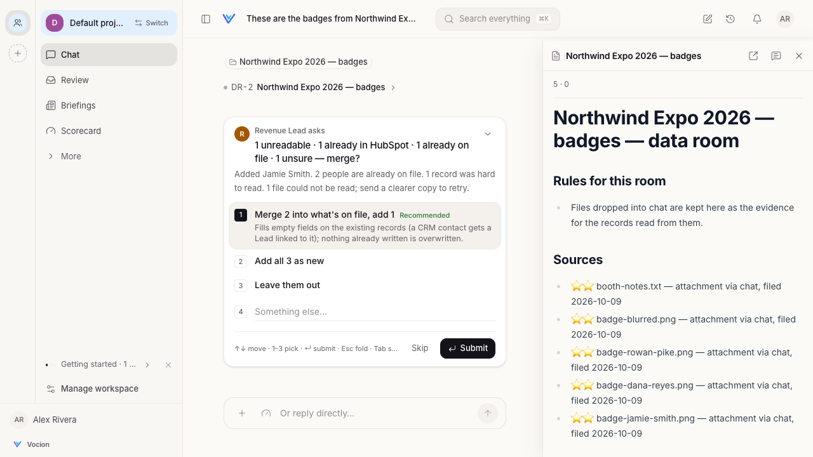
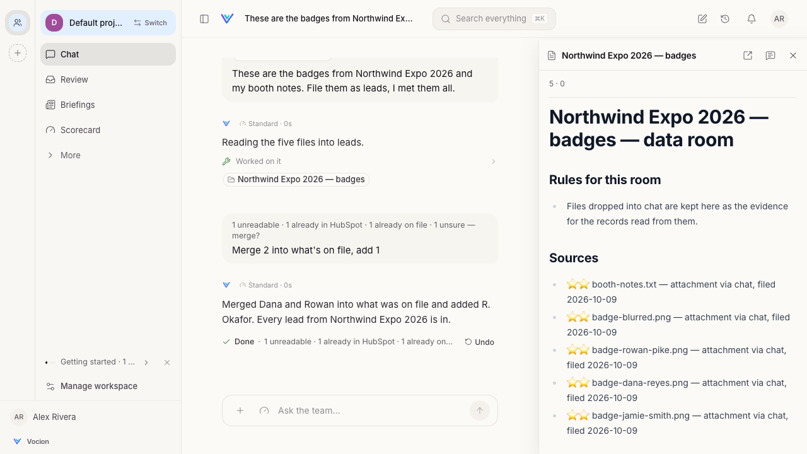
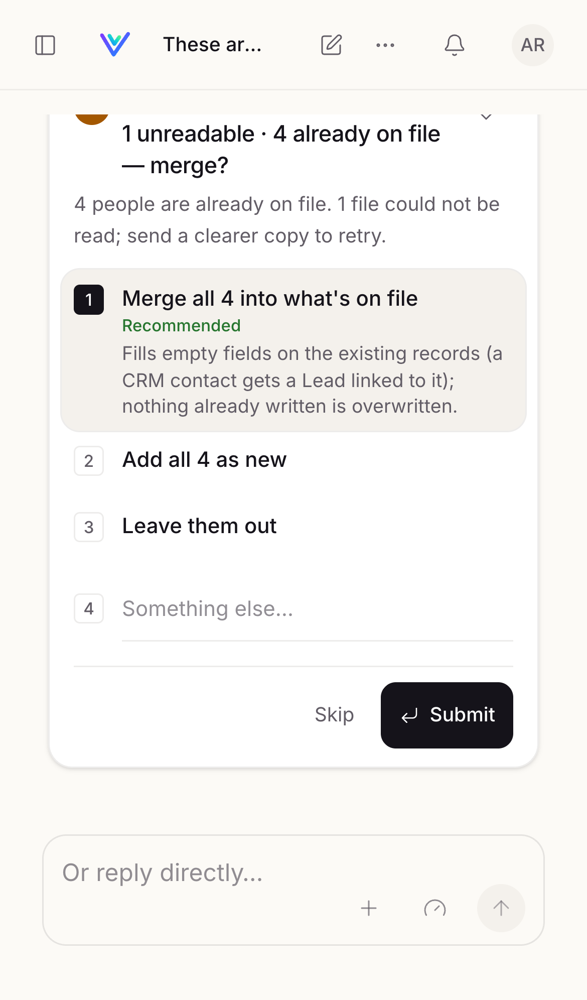

# List intake

A person comes back from an event with a pile of scanned badges, business cards and notes. They drop the pile into chat and say what it is. Vocion organises it into records, researches and positions every one of them, and keeps the follow-up moving.

There is no "event leads" feature. Chat is the way in, and the agent composes generic primitives. **Records are the truth, and documents are views of them.** This guide covers the primitives in the order a pile meets them.

Fixtures throughout are fictional: a made-up event, *Northwind Expo 2026*, and the fixture cast from `libs/fixtures/realDataGuard.ts`.

## 1. Extract records from dropped files: `extract_records`

The person drops files into the conversation. These can be photos of badges or cards (PNG, JPEG, WebP), PDFs, text notes, or CSV exports. They write something like *"These are the badges from Northwind Expo 2026, I met them all at the booth."* The agent calls:

```json
{
  "object_type": "lead",
  "room": "Northwind Expo 2026 — badges",
  "set": { "event": "Northwind Expo 2026", "met_by": "Alex" },
  "hint": "badges scanned at our booth"
}
```

The agent picks the object type and names the room from context. The call then runs these steps (`services/intake/intake.ts`):

1. **Each file is read once.** Images go to the extractor model as images. Documents go as the text extracted when they were uploaded (`services/chat/attachments.ts`). The model is offered the type's declared fields (`services/intake/fields.ts`). For every value it gives a **confidence**, the **page** (or **row**, for a table), and the **quote** when the printed words differ from the value. No tools are bound to the reader. Every call is charged and traced as `tool.extract`.
2. **The files go into a data room**, which is the room the agent named, or a new one. Each file is anchored to the room as its evidence (`source:<id>`). Anchoring has two effects:
   - The first record written afterwards does not claim every upload in the thread.
   - Calling the tool again reads only new files, so nothing is charged twice.
3. **Duplicates are folded** (`services/intake/dedupe.ts`). Two people are the same person when they share an email, or when they share both a name and a company. The comparison ignores case, accents and punctuation. Two readings of one person within the batch become one record: the surer value wins for each field, and both files are kept as sources.
4. **Records already on file are matched.** The batch is checked against:
   - records of the same type, and
   - contacts a CRM sync mirrored into the index.

   The connector that filed a contact gives the system its name, so the card can say "already in HubSpot".
5. **Clear records are written.** Each record gets `provenance` with:
   - `sources`: the files it came from;
   - `fields`: for each field, `{ artifactId, file, page | row, confidence, quote?, from }`, where `from` is `conversation` for values the agent set from what the person said;
   - `intake`: the batch, the room, and who wrote it.
6. **The rest becomes ONE Decision.** Some items are held back:
   - files that could not be read;
   - records the reader was unsure of (confidence below 0.6, no readable name, or an identity field that is hard to read);
   - people already on file or already in the CRM.

   These come up as one card, raised by the tool in the person's turn, for example **"1 unreadable · 1 already in HubSpot · 1 already on file · 1 unsure — merge?"**. Raising it ends the turn. The card's options run `records.settle_intake`:
   - **Merge** (recommended when there are duplicates). It fills empty fields on the existing record and never overwrites. For a CRM contact it creates a record linked by the CRM's own key (`external_system` / `external_id`). Unsure records are added as read.
   - **Add all as new.**
   - **Leave them out.**

   Undo removes what was added and restores what was filled. Unreadable files are listed so the person can send a clearer copy, and they are never written.

Outside a person's turn, in a mission for example, the held items come back in the tool result for the agent to file with `file_ask`.

### Identity fields

A type declares which fields identify a record with `x-identity`:

```yaml
schema:
  type: object
  x-identity: {email: email, name: full_name, company: company}
  properties:
    full_name: {type: string}
    email: {type: string, format: email}
    company: {type: string}
```

If a type declares none, any field with `format: email` identifies the record. The agent can also name the fields in the call (`identity`). Core never guesses an identity from a field's name.

### What the person sees

- One line from the agent saying what was added, with links.
- The data room, which holds every file.
- One docked Decision for the rest. It is answered with the keyboard (see `docs/guides/decisions.md`).







The flow is replayed end to end, with a scripted model, by `npm run e2e:list-intake` (`packages/core/e2e/list-intake`). Set `LIST_INTAKE_SHOTS` to write these screenshots.
